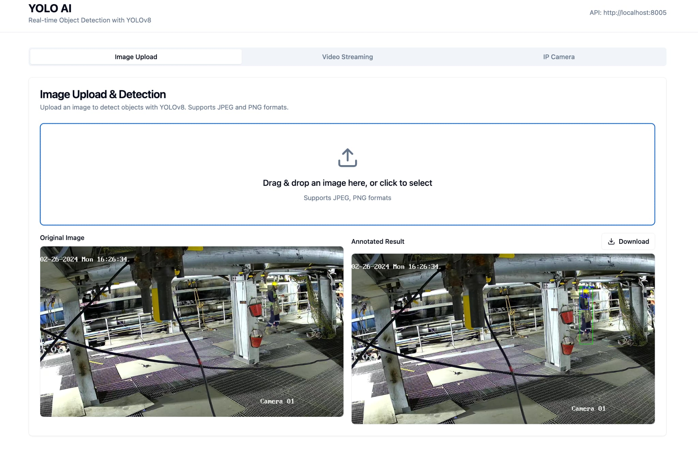

# YOLO-AI: High-Performance Real-Time Object Detection Framework

**A production-ready framework for easy deployment, high-quality inference, and fast real-time streaming via WebSocket.**

---

## 🎯 Overview

YOLO-AI is a complete end-to-end framework for real-time object detection that enables seamless deployment from model training to production. Built with YOLOv8, BentoML, and WebSocket streaming, it delivers high-quality detection results with minimal latency.

---

## 🔄 Complete Workflow: Train → Convert → Deploy

### Workflow Overview

| Stage | Description | Output |
|-------|-------------|--------|
| **1. Train** | Train YOLOv8 model on custom dataset | `.pt` model weights |
| **2. Convert** | Convert PyTorch model to ONNX format | `.onnx` optimized model |
| **3. Deploy** | Deploy ONNX model to BentoML service | Production-ready API service |

### Detailed Steps

#### 1. Train Model
```bash
# Train YOLOv8 model on your dataset
from ultralytics import YOLO

model = YOLO('yolov8n.pt')
model.train(data='your_dataset.yaml', epochs=100, imgsz=640)
# Output: weights/best.pt
```

#### 2. Convert to ONNX
```bash
# Convert trained model to ONNX for optimized inference
python -m src.quantization.onnx_model \
  --model_path weights/best.pt \
  --output_path weights/
```

#### 3. Deploy to BentoML
```bash
# Deploy ONNX model to BentoML
python -m src.deploy.deploy \
  --onnx_path weights/best.onnx

# Build BentoML service
bentoml build

# Serve locally
bentoml serve yolov8-service:latest --port 3000
```

---

## 🔄 Application Flow: UI → Backend → UI

### Request Flow Diagram

```
┌─────────────┐
│   Frontend  │
│   (React)   │
└──────┬──────┘
       │
       │ 1. User Action (Upload/Stream)
       │
       ▼
┌─────────────────────────────────────┐
│      API Server (aiohttp)           │
│      Port: 8005                      │
└──────┬───────────────────┬───────────┘
       │                   │
       │ 2. Process        │ 3. WebSocket
       │    Request        │    Stream
       │                   │
       ▼                   ▼
┌──────────────┐    ┌─────────────────┐
│ BentoML      │    │ YouTube Stream  │
│ Service      │    │ (yt-dlp+ffmpeg) │
│ Port: 3000   │    │                 │
└──────┬───────┘    └────────┬────────┘
       │                     │
       │ 4. YOLO Inference  │ 5. Frame Processing
       │    (ONNX Runtime)   │    (YOLO Detection)
       │                     │
       └──────────┬──────────┘
                  │
                  │ 6. Annotated Frame
                  │
                  ▼
         ┌─────────────────┐
         │  WebSocket      │
         │  Response       │
         └────────┬────────┘
                  │
                  │ 7. Display Result
                  │
                  ▼
         ┌─────────────────┐
         │   Frontend UI   │
         │   (Canvas)       │
         └─────────────────┘
```

### Step-by-Step Flow

| Step | Component | Action | Data Flow |
|------|-----------|--------|-----------|
| **1** | Frontend | User uploads image/YouTube URL | Image/URL → API Server |
| **2** | API Server | Receives request, processes frame | Frame → BentoML Service |
| **3** | BentoML | YOLO inference on frame | Frame → Detections |
| **4** | API Server | Annotates frame with bounding boxes | Detections → Annotated Frame |
| **5** | WebSocket | Streams annotated frames | Annotated Frame → Frontend |
| **6** | Frontend | Displays result on canvas | Annotated Frame → UI Display |

---

## 🎨 Frontend Features

### Feature Overview

| Feature | Description | Component |
|---------|-------------|-----------|
| **Image Upload** | Upload single image for detection | `ImageUpload.tsx` |
| **YouTube Streaming** | Stream YouTube videos with real-time detection | `VideoStreamUpload.tsx` |
| **IP Camera** | Connect to IP cameras for live detection | `IPCameraStream.tsx` |

### Detailed Features

#### 1. Image Upload & Detection
- **Drag-and-drop** image upload interface
- **Real-time** annotation with bounding boxes
- **Download** annotated results
- **Support formats**: JPEG, PNG
- **Display**: Confidence scores and class labels

#### 2. YouTube Video Streaming
- **URL input** for YouTube videos
- **Real-time streaming** via WebSocket
- **Frame-by-frame** detection processing
- **FPS counter** and detection statistics
- **Play/Stop** controls

#### 3. IP Camera Streaming
- **IP camera** connection support
- **Local device** camera access
- **Live streaming** with real-time detection
- **Connection status** indicator

---

## ⚙️ Backend Features

### Core Capabilities

| Feature | Technology | Description |
|---------|------------|-------------|
| **Model Serving** | BentoML | Production-ready ML model serving |
| **Real-time Streaming** | WebSocket | Low-latency video streaming |
| **Video Processing** | yt-dlp + ffmpeg | YouTube stream extraction and decoding |
| **Object Detection** | YOLOv8 + ONNX | High-performance inference |
| **Image Processing** | OpenCV + PIL | Frame annotation and encoding |

### API Endpoints

| Endpoint | Method | Description | Input | Output |
|----------|--------|-------------|-------|--------|
| `/api/v1/upload` | POST | Upload image for detection | Image file | Annotated JPEG |
| `/ws/youtube` | WebSocket | YouTube video streaming | YouTube URL | Annotated frames (base64) |

### Backend Architecture

```
┌─────────────────────────────────────────┐
│         API Server (aiohttp)            │
│  - WebSocket Handler                    │
│  - Image Upload Handler                 │
│  - CORS Middleware                      │
└──────────────┬──────────────────────────┘
               │
               ├───► YouTubeStreamer
               │     - yt-dlp (extract URL)
               │     - ffmpeg (decode stream)
               │     - Frame processing
               │
               └───► BentoML Service
                     - ONNX Runtime
                     - YOLO Inference
                     - Detection results
```

---

## 🛠️ Technologies & Problem Solving

### Technology Stack

#### Deep Learning: YOLOv8 (Ultralytics)
YOLOv8 is a state-of-the-art object detection model that provides accurate real-time detection capabilities. It's designed for production use with excellent balance between speed and accuracy. The framework supports custom training on domain-specific datasets, making it ideal for specialized detection tasks like PPE (Personal Protective Equipment) detection. YOLOv8 can detect multiple objects in a single frame with high precision, making it perfect for real-time video streaming applications.

#### Model Serving: BentoML
BentoML is a production-ready machine learning model serving framework that simplifies the deployment of ML models at scale. It provides several key features:

- **Automatic API Generation**: BentoML automatically generates RESTful APIs from your model code, eliminating the need to write boilerplate API code manually. It handles request/response serialization, validation, and error handling out of the box.

- **Model Versioning**: Built-in model versioning system allows you to manage multiple versions of your models, enabling easy rollbacks and A/B testing. Each model version is tracked with metadata, making it easy to understand which model is deployed in production.

- **Horizontal Scaling**: BentoML services can be easily scaled horizontally across multiple instances. It supports load balancing and can handle high concurrent request volumes, making it suitable for production environments with varying traffic patterns.

- **Docker Integration**: One-command Docker containerization (`bentoml containerize`) makes it easy to deploy models in containerized environments. This enables consistent deployments across different environments (development, staging, production).

- **GPU Support**: Native support for GPU acceleration, allowing models to leverage CUDA-enabled GPUs for faster inference. This is crucial for real-time applications where latency matters.

- **Monitoring & Observability**: Built-in metrics and logging capabilities help monitor model performance, request latency, and error rates in production.

- **Multi-Framework Support**: Works with various ML frameworks (PyTorch, TensorFlow, ONNX, etc.), making it framework-agnostic and flexible for different use cases.

In this project, BentoML serves the YOLOv8 ONNX model, handling inference requests from the API server. It processes frames and returns detection results (bounding boxes, confidence scores, class IDs) that are then used to annotate video frames before streaming to the frontend.

#### Model Optimization: ONNX Runtime
ONNX (Open Neural Network Exchange) Runtime is a high-performance inference engine that optimizes model execution across different hardware platforms. It provides:

- **Cross-Platform Compatibility**: ONNX models can run on CPU, GPU (CUDA), and specialized accelerators, providing flexibility in deployment environments.

- **Performance Optimization**: ONNX Runtime includes graph optimizations, operator fusion, and quantization techniques that can improve inference speed by 3-5x compared to native PyTorch models.

- **Memory Efficiency**: Optimized memory allocation and reuse reduce memory footprint, allowing models to run on resource-constrained devices.

- **Production Stability**: ONNX Runtime is battle-tested in production environments and provides consistent performance across different platforms.

In this framework, YOLOv8 models are converted from PyTorch (`.pt`) to ONNX format (`.onnx`) for optimized inference. The ONNX model is then served via BentoML, providing fast and efficient object detection.

#### Real-Time Streaming: WebSocket
WebSocket is a communication protocol that provides full-duplex communication channels over a single TCP connection. Unlike traditional HTTP request-response patterns, WebSocket enables persistent connections that allow real-time bidirectional data transfer.

**Key Features:**
- **Low Latency**: WebSocket eliminates the overhead of establishing new connections for each request, resulting in sub-second latency for real-time data transfer. This is crucial for video streaming applications where frames need to be delivered continuously.

- **Persistent Connection**: Once established, the WebSocket connection remains open, allowing continuous data streaming without the overhead of HTTP headers and connection establishment for each frame.

- **Bidirectional Communication**: Both client and server can send data at any time, enabling real-time control and feedback. The server can push frames to the client, and the client can send control messages (start, stop, pause) back to the server.

- **Firewall Friendly**: Unlike WebRTC which requires STUN/TURN servers to traverse NAT and firewalls, WebSocket works seamlessly through most firewalls and proxies, making it easier to deploy in enterprise environments.

- **Reliable Delivery**: Built on TCP, WebSocket ensures reliable, ordered delivery of messages, which is important for video streaming where frame order matters.

- **Simple Implementation**: WebSocket API is straightforward to implement on both client and server sides, reducing development complexity compared to WebRTC's complex signaling and ICE negotiation.

In this framework, WebSocket is used to stream annotated video frames from the backend to the frontend. Each frame is processed through YOLO detection, annotated with bounding boxes, encoded as JPEG, and sent as base64-encoded data through the WebSocket connection. The frontend receives these frames and displays them on a canvas element in real-time.

#### Video Processing: yt-dlp + ffmpeg
**yt-dlp** is a powerful command-line program to download videos and extract metadata from YouTube and other video platforms. It's a fork of youtube-dl with additional features and improvements.

- **Stream URL Extraction**: yt-dlp can extract direct video stream URLs from YouTube videos, bypassing the need to download entire videos. This enables real-time streaming from YouTube URLs.

- **Format Selection**: Intelligent format selection allows choosing the best quality stream based on resolution, codec, and bandwidth requirements. The framework selects formats up to 720p for optimal balance between quality and processing speed.

- **Metadata Extraction**: Extracts video metadata including resolution, frame rate, duration, and format information, which is used to configure the streaming pipeline.

**ffmpeg** is a comprehensive multimedia framework that can decode, encode, transcode, mux, demux, stream, filter, and play media files.

- **Stream Decoding**: ffmpeg decodes YouTube video streams in real-time, converting them to raw video frames (BGR24 format) that can be processed by OpenCV and YOLO models.

- **Format Conversion**: Converts various video formats and codecs to a standardized format (raw BGR24) that the detection pipeline can process consistently.

- **Frame Rate Control**: Limits output frame rate to match the desired processing rate (20 FPS), preventing overwhelming the detection pipeline with too many frames.

- **Efficient Processing**: ffmpeg's optimized codecs and processing pipeline ensure minimal CPU overhead while decoding video streams.

Together, yt-dlp and ffmpeg enable the framework to stream YouTube videos directly from URLs without requiring video file downloads, making it easy to test and demonstrate the detection system with any YouTube video.

#### Frontend: React + TypeScript
**React** is a popular JavaScript library for building user interfaces, particularly single-page applications. It provides:

- **Component-Based Architecture**: Modular, reusable components make the codebase maintainable and scalable. Each feature (Image Upload, Video Streaming, IP Camera) is implemented as a separate component.

- **Virtual DOM**: React's virtual DOM enables efficient updates to the UI, ensuring smooth performance even when displaying video frames at high frame rates.

- **Rich Ecosystem**: Extensive ecosystem of libraries and tools (hooks, state management, UI components) accelerates development.

**TypeScript** adds static type checking to JavaScript, providing:

- **Type Safety**: Catches errors at compile-time rather than runtime, reducing bugs and improving code quality.

- **Better IDE Support**: Enhanced autocomplete, refactoring, and navigation in IDEs like VS Code.

- **Self-Documenting Code**: Type annotations serve as inline documentation, making the code easier to understand and maintain.

#### UI Components: Tailwind CSS + shadcn/ui
**Tailwind CSS** is a utility-first CSS framework that enables rapid UI development:

- **Rapid Development**: Utility classes allow building complex layouts without writing custom CSS, significantly speeding up development.

- **Consistent Design**: Pre-defined spacing, colors, and typography scales ensure consistent design across the application.

- **Responsive Design**: Built-in responsive utilities make it easy to create mobile-friendly interfaces.

**shadcn/ui** is a collection of re-usable components built with Radix UI and Tailwind CSS:

- **Accessible Components**: Built on Radix UI primitives, ensuring accessibility standards are met out of the box.

- **Customizable**: Components are copied into your project, allowing full customization without being locked into a specific version.

- **Modern Design**: Professional, modern component designs that look great without additional styling effort.

Together, Tailwind CSS and shadcn/ui enable rapid development of a professional, accessible, and responsive user interface.

#### State Management: Zustand
Zustand is a small, fast, and scalable state management solution for React:

- **Lightweight**: Minimal bundle size (~1KB) compared to alternatives like Redux, reducing application load time.

- **Simple API**: Straightforward API with hooks-based access, making it easy to learn and use.

- **Performance**: Efficient re-renders only when specific state values change, ensuring optimal performance for real-time applications.

- **No Boilerplate**: Unlike Redux, Zustand requires minimal boilerplate code, making state management simple and straightforward.

In this framework, Zustand manages detection-related state (errors, loading states) across components, enabling clean separation of concerns and efficient state updates.

### Problems Solved

#### High Latency in Real-Time Applications
Traditional HTTP request-response patterns introduce significant latency due to connection establishment overhead and request/response cycles. For video streaming applications, this can result in noticeable delays between user actions and visual feedback.

**Solution**: WebSocket provides persistent connections that eliminate connection overhead. Once established, frames can be streamed continuously with minimal latency. Combined with efficient frame encoding (JPEG compression) and optimized detection pipeline, the framework achieves sub-second end-to-end latency from frame capture to display.

**Result**: Users experience smooth, real-time video streaming with detection annotations appearing almost instantly, creating a responsive and engaging user experience.

#### Complex ML Model Deployment
Deploying machine learning models to production typically requires writing custom API code, handling serialization/deserialization, managing model versions, setting up monitoring, and configuring scaling. This complexity often leads to deployment delays and maintenance challenges.

**Solution**: BentoML abstracts away the complexity of ML model deployment. With BentoML, you simply define your model's prediction function, and BentoML automatically generates a production-ready API service. It handles request validation, response formatting, error handling, and provides built-in monitoring capabilities.

**Result**: Deployment becomes a one-command process (`bentoml build` followed by `bentoml serve`), reducing deployment time from days to minutes. The framework can be easily scaled horizontally, and model versions can be managed seamlessly.

#### Slow Model Inference
Native PyTorch models, while flexible, are not optimized for production inference. They include unnecessary overhead for training capabilities and may not leverage hardware acceleration optimally.

**Solution**: Converting models to ONNX format and using ONNX Runtime for inference provides significant performance improvements. ONNX Runtime includes graph optimizations, operator fusion, and efficient memory management that can improve inference speed by 3-5x compared to native PyTorch.

**Result**: Faster inference enables higher frame rates (20 FPS) and lower latency, making real-time detection feasible even on modest hardware. GPU acceleration further improves performance, allowing the system to process more concurrent streams.

#### NAT and Firewall Traversal Issues
WebRTC, while powerful for peer-to-peer communication, requires complex NAT traversal mechanisms (STUN/TURN servers) to work across different network configurations. This adds deployment complexity and can fail in restrictive network environments.

**Solution**: WebSocket works seamlessly through most firewalls and proxies without requiring special configuration. It uses standard HTTP upgrade mechanism, making it compatible with existing network infrastructure.

**Result**: The framework works reliably in various network environments, including corporate networks with strict firewall policies, without requiring additional infrastructure like TURN servers.

#### YouTube Video Integration
Integrating YouTube videos into a detection pipeline typically requires downloading entire videos, which is time-consuming and storage-intensive. Real-time streaming from YouTube URLs is challenging due to YouTube's complex streaming protocols.

**Solution**: yt-dlp extracts direct stream URLs from YouTube videos, and ffmpeg decodes these streams in real-time. This enables direct streaming from YouTube URLs without downloading videos, making it easy to test and demonstrate the system with any YouTube video.

**Result**: Users can simply paste a YouTube URL and immediately see real-time detection results, making the system highly accessible and easy to demonstrate. No video downloads or file management required.

#### Resource Management and Scalability
Processing every frame through a deep learning model can be computationally expensive, especially at high frame rates. This can overwhelm GPU/CPU resources and limit the number of concurrent streams the system can handle.

**Solution**: Frame skipping strategy (processing every 3rd frame) reduces computational load while maintaining visual continuity. Users don't notice the skipped frames, but the system uses significantly fewer resources. Additionally, BentoML's horizontal scaling capabilities allow the system to handle multiple concurrent streams by distributing load across multiple service instances.

**Result**: The system can handle multiple concurrent video streams efficiently, making it suitable for production deployments with varying traffic patterns. Resource usage is optimized, reducing infrastructure costs.

#### Scalability and High Concurrency
As the number of concurrent users increases, a single server instance may become a bottleneck, limiting the system's ability to serve multiple users simultaneously.

**Solution**: BentoML's architecture supports horizontal scaling. Multiple BentoML service instances can be deployed behind a load balancer, distributing inference requests across instances. The API server can also be scaled horizontally, and WebSocket connections can be distributed across multiple API server instances.

**Result**: The system can scale to handle hundreds or thousands of concurrent users by adding more service instances. This makes it suitable for production deployments with high traffic volumes, ensuring consistent performance even under heavy load.

---

## 📊 Example: PPE (Personal Protective Equipment) Detection

### Use Case
Detect Personal Protective Equipment (PPE) including:
- **Person**
- **Helmet**
- **Vest**
- **Shoes**

### Detection Results



### Configuration

```python
CLASS_NAMES = {
    0: "person",
    1: "helmet",
    2: "vest",
    3: "shoes"
}
```

### Performance Metrics

| Metric | Value | Description |
|--------|-------|-------------|
| **FPS** | 18-20 | Frames per second processed |
| **Latency** | <100ms | End-to-end detection time |
| **Accuracy** | High | YOLOv8-based detection |
| **Frame Skip** | Every 3rd frame | Optimized processing |

---

## 🚀 Quick Start

### Prerequisites

| Requirement | Version | Purpose |
|-------------|---------|---------|
| Python | 3.10+ | Backend runtime |
| Node.js | 18+ | Frontend runtime |
| CUDA | 11.8+ (optional) | GPU acceleration |
| ffmpeg | Latest | Video processing |
| yt-dlp | Latest | YouTube extraction |

### Installation

1. **Clone repository**
   ```bash
   git clone <repository-url>
   cd yolo-ai
   ```

2. **Install backend dependencies**
   ```bash
   pip install -r requirements.txt
   ```

3. **Install frontend dependencies**
   ```bash
   cd app
   npm install
   ```

### Running the Application

#### 1. Start BentoML Service
```bash
bentoml serve yolov8-service:latest --port 3000
```

#### 2. Start API Server
```bash
python -m src.api.v1 --host 0.0.0.0 --port 8005
```

#### 3. Start Frontend
```bash
cd app
npm run dev
```

#### 4. Access Application
- **Frontend**: `http://localhost:8081`
- **API Server**: `http://localhost:8005`
- **BentoML Service**: `http://localhost:3000`

---

## ⚙️ Configuration

### Environment Variables

| Variable | Default | Description |
|----------|---------|-------------|
| `BENTO_ENDPOINT_URL` | `http://localhost:3000` | BentoML service URL |
| `FPS_LIMIT` | `20` | Maximum frames per second |
| `FRAME_SKIP` | `3` | Process every Nth frame |
| `CONF_THRES` | `0.20` | Confidence threshold |
| `IOU_THRES` | `0.3` | IoU threshold for NMS |
| `CUDA_VISIBLE_DEVICES` | `1` | GPU device ID |

---

## 📦 Project Structure

```
yolo-ai/
├── src/
│   ├── api/              # API endpoints (WebSocket, REST)
│   ├── deploy/           # BentoML deployment
│   ├── quantization/     # Model conversion (ONNX, TensorRT)
│   └── config.py        # Configuration
├── app/                  # Frontend (React + TypeScript)
│   ├── src/
│   │   ├── components/  # UI components
│   │   ├── hooks/       # React hooks
│   │   └── lib/         # Utilities
├── weights/              # Model weights
├── scripts/              # Utility scripts
└── requirements.txt     # Python dependencies
```

---

## 🎯 Key Advantages

| Advantage | Description |
|-----------|-------------|
| **Easy Deployment** | One-command deployment with BentoML |
| **High Quality** | YOLOv8 state-of-the-art detection |
| **Fast Performance** | WebSocket streaming, ONNX optimization |
| **Production Ready** | Scalable, error handling, logging |
| **Developer Friendly** | Clear documentation, simple API |

---

## 📝 License

[Add your license information here]

---

## 🤝 Contributing

[Add contribution guidelines here]

---

**Built with ❤️ for production-ready object detection**
